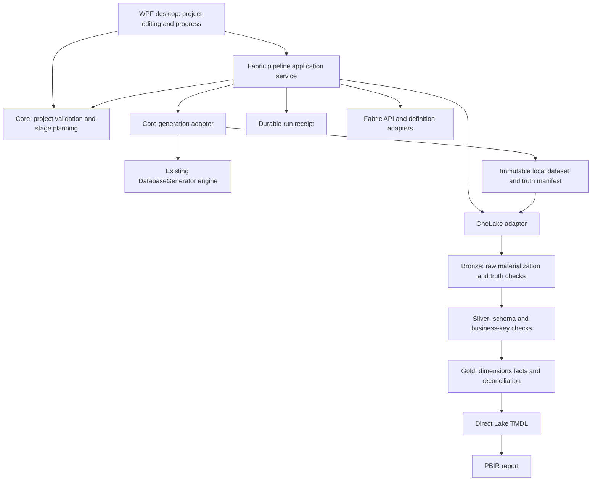

# Architecture decisions and correctness contract

Status: tech-lead direction dated 2026-09-08. “Current” describes inspected code;
“S01 target” is approved implementation work; later targets require their sprint brief.

Dependency ownership:

- `DatabaseGenerator` remains the existing data motor. Preserve its fixed Random(0),
  formulas, reference handling, and output semantics unless the lead approves a change.
- `ContosoFabric.Core` owns project contracts, planning, local dataset identity and the
  generator adapter. No WPF or Fabric REST dependencies belong here.
- `ContosoFabric.Fabric` owns orchestration and external adapters, notebook/model/report
  definitions, receipts, and remote status. Keep runtime-independent definition factories.
- `ContosoFabric.Desktop` owns interaction and presentation; business decisions belong
  below it so they are testable without driving WPF.
- `ContosoFabric.Core.Tests` currently references the Fabric layer too. Keep the existing
  project during S01; renaming or splitting projects is not required for this sprint.

## ADR-001 — Dataset identity is distinct from execution identity

Current: the engine destructively prepares shared `generated/data`; the adapter serializes
generation only. A run receipt has its own RunId but no committed dataset identity.

S01 target: generate into a unique owned `generated/datasets/<dataset-id>/data` directory.
Validate expected files and create the manifest before publishing a dataset descriptor.
Publish `generated/current_dataset.json` by temporary-file replacement only after success.
The descriptor has a schema version, dataset ID, relative data path, project/config
fingerprint, manifest digest, and creation time. Include file inventory with relative
paths, byte lengths and SHA-256 digests in the versioned dataset metadata; exclude logs.
Fingerprint normalized effective generation inputs plus baseline config/workbook digests,
not workspace names or stage range. Keep manifest v1 readable. Put new fields in a
versioned contract with explicit unsupported-version errors.

Return the committed dataset descriptor from generation; the full runner must pass that
exact descriptor to upload. Never re-resolve “latest” halfway through a run. A failed or
cancelled generation leaves the previous descriptor unchanged and its own partial directory
unpublished. It must not automatically continue with the previous dataset. Keep shared
reference cache and process-wide generator serialization. Dataset directories are immutable
once committed. No automatic old-dataset deletion is part of S01.

For Bronze-only, resolve the descriptor once, validate its inventory, raw format and
effective generation fingerprint, and fail clearly on a mismatch. Existing `generated/data`
remains readable through an explicitly labelled legacy/manual path when no descriptor exists.
Require all expected tables for that format; report reduced provenance if manifest absent.
A corrupt descriptor must fail, never fall back silently. Validate canonical path containment;
reject absolute/parent paths and reparse-point escapes before reading metadata-driven files.
S01 does not promise coordination of two processes writing to the same remote targets.

## ADR-002 — Narrow test seams, one orchestration policy

S01 target: interfaces or equivalent injectable delegates for generator, catalog/provisioning,
definition deployment, raw upload, clock/delay, and receipt persistence at actual effect
boundaries. Keep default constructors/composition convenient for WPF. Fake implementations
must record calls and inject failures; tests assert both calls made and calls forbidden.
Avoid a general plugin system or dependency-injection framework migration.

Unify duplicate-name resolution: zero matches may create where allowed, one reuses, more
than one fails before mutation. Match type and case-insensitive display name consistently,
including create-follow-up lookup. Never choose an arbitrary Lakehouse/notebook.

S01 transport: injectable HttpClient and credentials for both REST paths; configurable
finite per-request timeout and a total operation deadline including credential acquisition,
requests and retry delays. Preserve separate caller cancellation vs timeout outcomes.
Keep bounded 429 retries, honoring valid Retry-After without exceeding the total deadline.
Do not automatically retry an ambiguous create/update/job POST after timeout or lost response.
Record outcome unknown and available identifiers so it can be reconciled later.
Validate absolute continuation/job URLs before attaching a token: HTTPS and the approved
Fabric API authority only for this client. Reject a foreign authority or cyclic pagination.
Use injected time in tests; do not make tests wait real minutes.

## ADR-003 — Receipts are recovery evidence

Current: start/end snapshots for Generate and Run; partial Prepare and failed job IDs are lost.

S01 target: versioned atomic snapshots at meaningful stage transitions, each returned item,
job submission/terminal observation, and finalization. Cover Generate, Run, Prepare, Upload;
record action kind separately from selected range. Record actual resolved workspace, dataset
identity when applicable, artifact type/ID, notebook ID + stage + job ID, safe error codes,
HTTP status, timestamps and outcome. Poll chatter must not grow snapshots without bound.
Serialize writes through one owner; terminal status must not be overwritten by queued events.

Initial receipt-write failure prevents effects from starting. Later persistence failures
must remain visible without turning a completed remote effect into “not executed.” Preserve
the original failure; expose a diagnostic warning and last durable receipt. Never serialize
tokens, arbitrary exception text, API bodies, or unbounded user/service content. A crash leaves
an incomplete/unknown receipt; do not infer remote cancellation from loss of local polling.
Automatic crash resume and remote cancellation are deferred. UI must explain that a remote
job may still run after local cancellation; active legacy generation stops at its next safe
boundary, and no later stage begins after cancellation is observed.

## ADR-004 — Data validity is stronger than successful execution

Current Bronze checks orders/orderrows counts when a manifest exists. Silver removes
duplicates on whichever expected keys happen to exist. Gold reconciles selected in-memory
dataframes and overwrites published tables before its final checks.

S02 required direction: validate complete required schemas and all business-key columns;
reject null keys, conflicting duplicate payloads, invalid dates/currencies and non-finite
numeric values. Exact duplicate rows may be removed with counted evidence; conflicting
rows require failure or an explicitly approved business policy, never arbitrary survival.
Check fact grain (OrderKey, LineNumber), dimensions including Date, all foreign keys,
orders/orderrows/sales lineage, and persisted aggregate totals for every published aggregate.
Use independent fixtures with hand-calculated results, not the same formula copied into
the test oracle. Money precision and rounding must be documented before enforcing tolerances.

Remote raw landing must identify one dataset and publish its completion metadata last.
Bronze must never consume a half-uploaded mixture. Do not implement recursive remote deletion
as the rerun strategy. Metadata-only start must verify upstream validation/provenance,
not just the existence of a same-name item.

Publication safety is a release blocker: checks at the end do not undo writes already
visible to an existing model. The lead must refine staged tables/versioned bindings and
the promotion/recovery protocol in S02 before implementation. Do not claim atomic multi-table
publication or “last good report remains safe” until demonstrated. Current gates block later
orchestrator actions; they do not protect existing readers against partial overwrites.

## ADR-005 — Honest BI semantics and verification levels

Preserve mixed-currency guards on Revenue Local and Gross Margin Local. Explain blank
totals in the report and verify zero, one and multiple currencies. Measures for ratios,
orders and customers require tests against intended aggregation grain. No implicit FX conversion.
TMDL/PBIR text tests establish construction contracts only; service acceptance, relationships,
queries, and rendered report behavior need live evidence. Deterministic visual IDs and stable
resource identity support reruns but do not prove service idempotency.

Cross-cutting invariants:

1. Invalid projects/ranges fail before generation or remote mutation. Validate all enum
   fields, required nested target objects and effective values, including loaded JSON.
2. Generate-only never acquires Azure credentials. Preflight is read-only and does not
   convert caller cancellation into an ordinary connection failure.
3. Only selected stages execute. Dependencies are resolved without rerunning them.
4. Failure/cancellation blocks later stages; receipts retain completed and unknown effects.
5. Requested orders are a generation target, not an exact count promise. Actual counts
   derive from completed output. Requested seed is not silently presented as effective seed.
6. Retry never silently duplicates an ambiguous mutation. Missing evidence remains unknown.
7. Preserve unrelated working-tree changes and compatibility with existing example projects.
